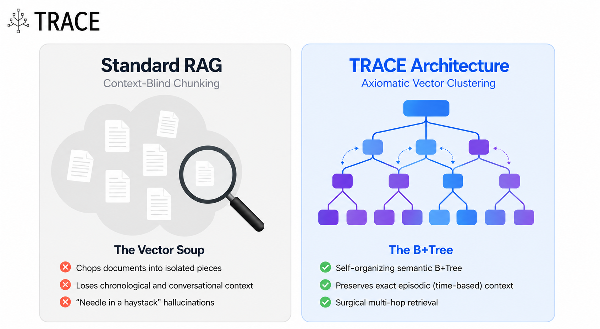
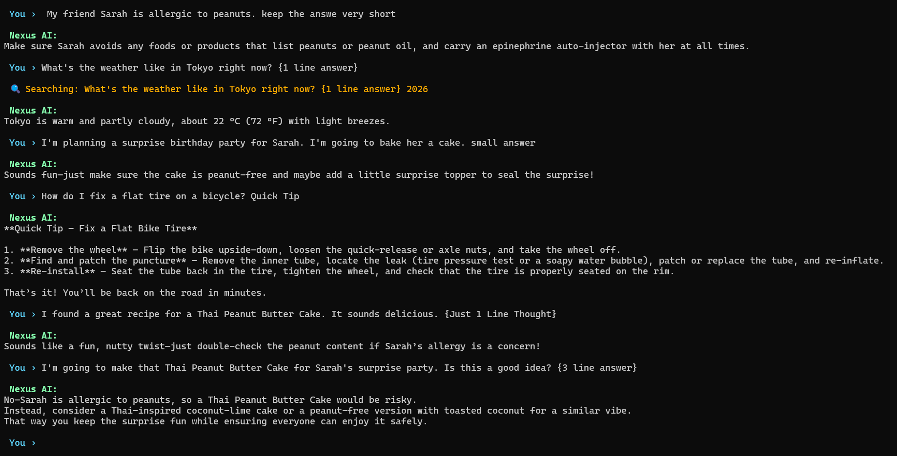
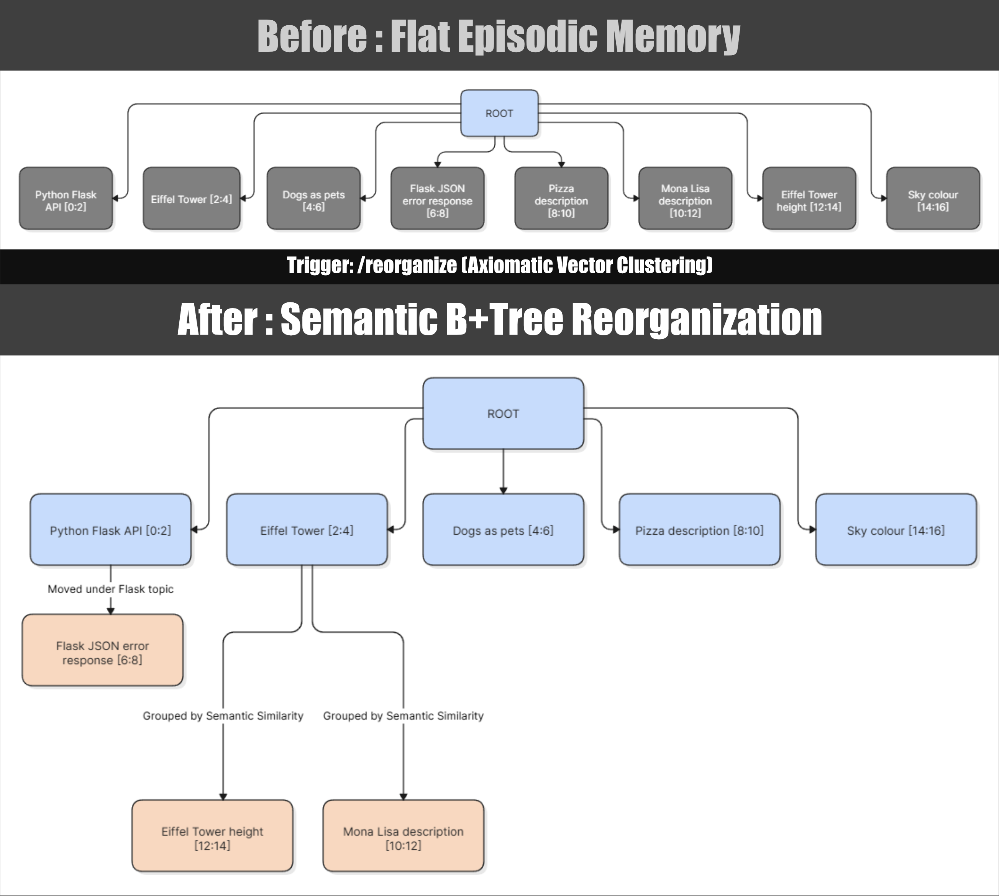
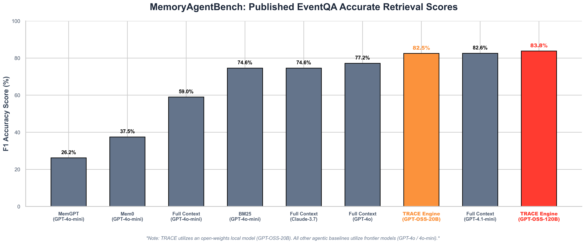

<div align="center">
  
</div>

# TRACE — Temporal Retrieval And Context Engine

> **A hierarchical, background memory tree for long-running LLM agents.**  
> TRACE organizes conversation history into a structured semantic map, allowing for efficient, multi-path retrieval of long-term context without relying on full-history prompt injection.

[](https://python.org)
[](https://pypi.org/project/trace-memory/)
[](https://opensource.org/licenses/Apache-2.0)
[](https://platform.openai.com/docs/api-reference)
[](benchmark_results/trace_120b_eventqa_64k_results.json)

> **This repo has two parts — they are completely independent:**
> - 🧠 **`trace_memory/`** — the lightweight memory engine. Install it, import it, and integrate it into your own app. Zero UI, zero bloat.
> - 🖥️ **`nexus_terminal/`** — an optional demo chatbot built on top of the engine. Use it to test TRACE live, explore how it works, and run experiments. You do not need it to use TRACE.

---

## Table of Contents

1. [What is TRACE?](#1-what-is-trace)
2. [Limitations of Standard RAG for Agent Memory](#2-limitations-of-standard-rag-for-agent-memory)
3. [The Architecture: How TRACE Fixes It](#3-the-architecture-how-trace-fixes-it)
   - [The Foundation — ChatIndex & the B+Tree](#31-the-foundation--chatindex--the-btree)
   - [Feature 1 — Multi-Path Surgical Retrieval](#32-feature-1--multi-path-surgical-retrieval)
   - [Feature 2 — Background Tree Organizer](#33-feature-2--background-tree-organizer)
   - [Feature 3 — Trivial Leaf Archiving](#34-feature-3--trivial-leaf-archiving)
4. [Installation](#4-installation)
5. [Quick Start: The Nexus Terminal](#-quick-start-the-nexus-terminal)
6. [Full API Reference](#6-full-api-reference)
   - [CTree](#61-ctree)
   - [VectorDatabase](#62-vectordatabase)
   - [PromptSynthesizer](#63-promptsynthesizer)
   - [Data Classes](#64-data-classes)
7. [Integration Guide](#7-integration-guide)
   - [With LM Studio (local)](#71-with-lm-studio-local)
   - [With OpenAI](#72-with-openai)
   - [With NVIDIA NIM / any OpenAI-compatible endpoint](#73-with-nvidia-nim--any-openai-compatible-endpoint)

8. [Benchmarks & Validation](#8-benchmarks--validation)
9. [Environment Variables](#9-environment-variables)
10. [Dependencies](#10-dependencies)
11. [Contributing](#11-contributing)
12. [License](#12-license)

---

## 1. What is TRACE?

TRACE is a Python library that gives your LLM agent **structured, searchable, self-organizing long-term memory**.

Instead of naïvely stuffing an ever-growing chat log into every prompt, TRACE organises every conversation exchange into a **hierarchical B+Tree of named topic branches**. When the agent needs context, TRACE performs a fast cosine similarity search across topic summaries and retrieves only the *surgically relevant* branches — not the entire history.

At rest (while the agent is not actively chatting), TRACE's **background reorganizer** evaluates the entire tree against four strict axioms and merges semantically related branches under shared parents — inspired by memory consolidation processes.

The result: an agent **designed to preserve cross-session constraints through hierarchical retrieval**, that reduces hallucination of stale context, and operates at **a fraction of the token cost** of sliding-window or full-history approaches.

---

## 2. Limitations of Standard RAG for Agent Memory

<div align="center">
  
</div>

Standard RAG works extremely well for:
- documentation search
- knowledge bases
- code retrieval
- enterprise search

The problem isn't RAG. The problem is using RAG as persistent memory.

### The Three Failure Modes

| Failure Mode | What Happens | Real Impact |
|---|---|---|
| **Temporal Blindness** | RAG retrieves semantically similar chunks regardless of *when* they occurred. Old, overridden decisions surface alongside current ones. | Agent contradicts itself, repeats resolved problems, or reinstates abandoned plans. |
| **Context Rot** | Sliding windows drop early messages as the conversation grows. | Constraints set in message 3 are gone by message 50. The agent forgets that Sarah is allergic to peanuts. |
| **Lossy Summarization** | Compressing history into a single paragraph erases detail and nuance. | Agent loses track of branching plans, multi-hop constraints, and edge-case handling agreed upon earlier. |

### Why Sliding Windows Fall Short for Long-Term Memory

A fixed-size sliding window is the most common approach — and it works well for on-demand, single-session queries where you need detailed, verbatim access to recent exchanges. But it is fundamentally unsuited for long-term agent memory:

- **No semantic awareness**: message #1 and message #200 are weighted equally as long as they fit.
- **Guaranteed forgetting**: anything outside the window is permanently gone from the agent's context.
- **No structure**: a flat list tells the LLM nothing about *which* topics are related or *which* branch an earlier constraint belongs to.

For a simple chatbot or a document Q&A tool, a sliding window is perfectly fine. For a long-running agent performing multi-step tasks across sessions, it is catastrophic.

### Why not MemGPT or Zep?

MemGPT is incredibly powerful, but it functions like a full operating system with tiered memory (RAM, disk) that the LLM must explicitly learn to manage via function calls. This introduces significant overhead and requires highly capable models. 

TRACE is meant to be a **lightweight, drop-in component**, not a full runtime environment. It focuses specifically on modelling conversations as a hierarchical tree to natively surface multi-hop constraints without forcing the LLM to actively manage its own memory banks.

---

## 3. The Architecture: How TRACE Fixes It

### 3.1 The Foundation — ChatIndex & the B+Tree

TRACE builds on the open-source **ChatIndex** architecture (credit: Mingtian Zhang, Ray, VectifyAI). A modified version of ChatIndex's core logic is bundled directly within TRACE, which models conversation history as a B+Tree:

- **Leaf nodes (MessageNodes)** — raw user/assistant exchanges.
- **Internal nodes (TopicNodes)** — LLM-generated topic labels and summaries for each branch.
- **Root** — a virtual anchor node.

Every time an exchange is added (`tree.add()`), TRACE forces the creation of a **new TopicNode** containing exactly one exchange. The LLM determines if it continues the current topic or starts a new branch. If it continues the topic, the new node is simply chained as a direct child of the previous one. This deep chronological chaining solves context truncation and ensures perfect, granular summarization for every single exchange.

This gives TRACE a **deep, structured map of the entire conversation history** — not a flat log — with highly granular topic metadata at every single link in the chain.

**What TRACE adds to ChatIndex**: ChatIndex primarily retrieves context through a single traversal path. While effective for hierarchical exploration, information spread across multiple semantically related branches may require multiple retrieval steps. TRACE augments this with vector-based retrieval across topic summaries, allowing context from multiple branches to be surfaced simultaneously.

---

### 3.2 Feature 1 — Multi-Path Surgical Retrieval

**The problem**: A single ancestry path only captures the current conversational thread. Cross-branch constraints (e.g., "Sarah's allergy" in Branch 1, "party cake" in Branch 3) are invisible unless both branches are active.

**The solution**: Every time the agent needs to respond, `PromptSynthesizer` runs a **cosine similarity search** against the VectorDatabase of embedded topic summaries:

```
User query  →  embed()  →  query vector
                              ↓
               VDB: cosine search across ALL topic summaries
                              ↓
               Filter: keep all nodes above base cosine threshold
                              ↓
               Walk full ancestry of each qualifying node
                              ↓
               Deduplicate shared ancestor nodes
                              ↓
               Rank by similarity → take Top-3 paths
                              ↓
               Format compact multi-path context block
```

This means the LLM receives context from **multiple relevant branches simultaneously**, not just the current thread — saving thousands of tokens compared to full-history injection, while synthesising information across branches that were never explicitly connected.

**The cross-branch synthesis stress test** (validated with `gpt-oss-20b` via NVIDIA NIM):

<div align="center">
  
</div>

```
Branch 1: "Sarah is allergic to peanuts."
Branch 2: "Weather in Tokyo?" (noise)
Branch 3: "Planning Sarah's surprise party, baking a cake."
Branch 4: "Fixing a bike tire?" (noise)
Branch 5: "Found a Thai Peanut Butter Cake recipe."

Prompt: "I'm making the Peanut Butter Cake for Sarah's party. Good idea?"

Result: The AI aggressively stopped the user.
        The VDB surgically bypassed Branches 2 & 4 (noise),
        retrieved Branches 1, 3, and 5,
        and synthesised them to catch the life-threatening allergy conflict
        — without any explicit link between them ever being made.
```

---

### 3.3 Feature 2 — Background Tree Organizer

<div align="center">
  
</div>

**The problem**: Long conversations naturally fragment. Topics discussed in different sessions may be semantically identical but live in separate branches, causing redundant retrieval and diluted context.

**The solution**: `tree.reorganize()` runs a conservative, four-rule-guarded merge pass:

```
Phase 1 — Collect all frozen (inactive) TopicNodes
Phase 2 — Generate missing summaries; embed all candidates
Phase 3 — Compute pairwise cosine similarity; for each pair above threshold, apply 4 axioms:
              Axiom 1 — Chronological Guard
              Axiom 2 — Frozen State check
              Axiom 3 — Similarity threshold (default 0.55)
              Axiom 4 — LLM Veto
           If all 4 pass → merge (newer becomes child of older)
Phase 4 — Optional: prune trivial leaf messages
```

#### The Four Axioms in Detail

| Axiom | Rule | Why |
|---|---|---|
| **1. Chronological Guard** | The older node absorbs the newer one — never the reverse. | Preserves temporal ordering. The past cannot be restructured to appear after the present. |
| **2. Frozen State** | Only nodes outside the currently active ancestry path may be merged. | The live conversation thread is *never* touched. Zero risk of corrupting the active agent state. |
| **3. Similarity Threshold** | Cosine similarity between embeddings must exceed the threshold (default: `0.55`). | Pre-filters pairs using pure math before wasting an LLM call. |
| **4. LLM Veto** | The LLM independently confirms the merge makes semantic sense. | Catches false positives (e.g., two topics both mentioning "Python" — one about snakes, one about code). If vetoed, the merge is aborted. |

**Analogy**: Just like a human brain during sleep — when the body is at rest, the brain doesn't switch off. It replays the day's events, consolidates important memories into long-term storage, and prunes connections that are no longer relevant. TRACE does exactly this: when the agent is idle, it reorganizes its memory graph, surfaces hidden connections across branches, and prunes redundancy — all without corrupting the live agent state.

---

### 3.4 Feature 3 — Trivial Leaf Archiving

Short, throwaway exchanges ("ok", "thanks", "got it") pollute the tree with noise that wastes tokens and dilutes retrieval quality.

When `prune_trivial_leaves=True` is passed to `reorganize()`, TRACE detects MessageNodes where both the user and assistant messages are under 20 words, and **soft-archives** them — moving them to `tree._archived_nodes` instead of hard-deleting them. They are persisted to disk in case you ever need them, but they are excluded from all future retrieval and prompt synthesis.

---

## 4. Installation

```bash
pip install trace-memory==1.0.7
```

---

### Minimal Integration (10 lines)

If you already have a chat loop and just want to plug TRACE in, this is all you need. Since TRACE includes a powerful built-in local embedder (`BAAI/bge-base-en-v1.5`), you don't even need to configure your own embedding model!

```python
from trace_memory.ctree import CTree
from trace_memory.vector_db import VectorDatabase
from trace_memory.prompt_synthesizer import PromptSynthesizer

# 1. Boot the tree and attach the Vector DB
tree = CTree(api_key="sk-...", model="gpt-4o-mini")
tree.vdb = VectorDatabase("session.db")

# 2. Setup the Prompt Synthesizer
synth = PromptSynthesizer(ctree=tree, vector_db=tree.vdb)

# 3. Each turn: build prompt → call LLM → store exchange
while True:
    user_input = input("You: ")
    system_prompt = synth.synthesize_prompt(
        user_query      = user_input,
        query_vector    = embed(user_input),
        active_node     = tree.current_node,
        recent_messages = tree.conversation[-6:],
    )
    response = client.chat.completions.create(
        model    = "gpt-4o-mini",
        messages = [{"role": "system", "content": system_prompt},
                    *tree.conversation[-10:],
                    {"role": "user", "content": user_input}],
    )
    reply = response.choices[0].message.content
    tree.add([{"role": "user", "content": user_input},
              {"role": "assistant", "content": reply}])
    print(f"AI: {reply}")

# 3. When the agent is idle, consolidate memory
stats = tree.reorganize(similarity_threshold=0.55, prune_trivial_leaves=True)
```

---

## 5. 🚀 Quick Start: The Nexus Terminal

TRACE comes with a fully-featured, gorgeous Terminal UI chatbot out of the box. It is designed as a lightweight sandbox just for testing out TRACE—seeing how it works, running tests, and exploring the engine without heavy frontend overhead.

**Key Features included in the terminal:**
* **Dynamic VRAM Swapping**: Hot-swaps models on the fly (unloading Text, loading Vision) to prevent local GPU crashes.
* **Live Web Search**: Pre-generation routing secretly checks DuckDuckGo to prevent hallucinations on current events.
* **Visualizing the B+Tree**: Use `/tree` to instantly print and inspect the live hierarchical memory map.
* **Multimodal Ingestion**: Drop images in the folder and use `/ingest` to extract rich descriptions directly into long-term memory.
* **Gorgeous TUI**: Threaded background spinners and ANSI colors so the UI never freezes while testing.

To run it immediately:

1. **Navigate to the terminal folder:**
   ```bash
   cd nexus_terminal
   ```
2. **Install the UI dependencies:**
   ```bash
   pip install -r requirements.txt
   ```
3. **Configure your models:**
   Rename `.env.example` to `.env` and adjust the models/URLs to point to your local LM Studio or OpenAI endpoints.
4. **Boot the engine:**
   ```bash
   python terminal.py
   ```

---

## 6. Full API Reference

### 6.1 `CTree`

The hierarchical conversation memory tree.

```python
from trace_memory import CTree
```

#### Constructor

```python
CTree(
    max_children:   int = 5,
    api_key:        str = None,        # optional: falls back to OPENAI_API_KEY env var or "lm-studio"
    base_url:       str = None,        # optional: route to custom endpoints (e.g. vLLM, Ollama, LM Studio)
    model:          str = "gpt-4o-mini",
    auto_save_path: str = None,        # auto-saves tree structure (not VDB) after every add() if set
    embed_fn:       Callable = None,   # optional: inject your embed function at construction time
)
```

#### Injectable attributes

```python
tree.vdb       = VectorDatabase("session.db")   # VDB for semantic retrieval
tree.embed_fn = embed                           # callable(text: str) -> List[float]
```

#### Methods

---

##### `tree.add(messages: List[dict])`

Ingest one completed exchange into the tree.

```python
tree.add([
    {"role": "user",      "content": "What is quantum entanglement?"},
    {"role": "assistant", "content": "Quantum entanglement is ..."},
])

# With an optional system/context message
tree.add([
    {"role": "system",    "content": "[Tool result]: 42.3°C"},
    {"role": "user",      "content": "Is that dangerous?"},
    {"role": "assistant", "content": "Yes, 42.3°C is critically high ..."},
])
```


---

##### `tree.reorganize(embed_fn=None, similarity_threshold=0.55, prune_trivial_leaves=False) -> dict`

Run one self-healing reorganization pass.

```python
stats = tree.reorganize(
    embed_fn              = embed,   # optional: overrides tree.embed_fn
    similarity_threshold  = 0.60,   # raise for more conservative merges
    prune_trivial_leaves  = True,    # archive short throwaway messages
)
print(stats)
# {'merged': 3, 'pruned': 7, 'skipped': 12, 'duration_secs': 4.2}
```

**When to call**: Periodically when the agent is idle. Not after every message.

---

##### `tree.save(filepath: str, save_conversation: bool = False)`

Persist the tree to JSON.

```python
tree.save("sessions/chat_001.json", save_conversation=True)
```

`save_conversation=True` embeds the raw message list so the session can be fully restored later.

##### `CTree.load(filepath: str, api_key: str = None, base_url: str = None, model: str = None, embed_fn: Callable = None) -> CTree`

Restore a tree from a JSON file.

```python
tree = CTree.load("sessions/chat_001.json", api_key="sk-...", embed_fn=embed)
tree.vdb = VectorDatabase("sessions/chat_001.db")
```

---

##### `tree.get_ancestors(node, include_self=True, exclude_root=False) -> List[TopicNode]`

Return the ordered ancestry chain from root down to `node`.

```python
path = tree.get_ancestors(tree.current_node, include_self=True, exclude_root=True)
for node in path:
    print(f"  {node.topic_name}: {node.summary}")
```

---

##### `tree.generate_summaries()`

Manually trigger LLM summarisation of all frozen branches.  
Called automatically during `save()` and internally during `reorganize()`. Can be used to manually pre-warm summaries if desired.

---

##### `tree.print_tree(node=None, indent=0, show_messages=False)`

Pretty-print the tree to stdout.

```python
tree.print_tree(show_messages=True)
```

Example output:
```
ROOT (sub-nodes: 3)
  ├─ Physics Discussions [0:12] (6 msgs)
     Covered quantum entanglement and black hole thermodynamics.
    ├─ Quantum Entanglement [0:6] (3 msgs)
    ├─ Black Holes [6:12] (3 msgs)
  ├─ Party Planning [12:20] (4 msgs)
     Planning Sarah's surprise birthday party logistics.
```

---

#### Key attributes

| Attribute | Type | Description |
|---|---|---|
| `tree.conversation` | `List[dict]` | Flat list of all raw messages in chronological order. |
| `tree.current_node` | `TopicNode` | The currently active topic branch. |
| `tree.root` | `TopicNode` | The virtual root of the tree. |
| `tree._archived_nodes` | `List[MessageNode]` | Soft-archived trivial leaf messages. |
| `tree.auto_save_path` | `str \| None` | If set, auto-saves the tree structure (not the VDB) after every `add()`. |

---

### 6.2 `VectorDatabase`

A local SQLite vector store with two active tables: conversation vectors and topic summaries.

> **Note on Scaling:** TRACE uses SQLite (`sqlite3`) for storage, `numpy` for fast cosine similarity, and `struct` for compact binary packing — all chosen to keep the footprint small while running on any machine. For massive scale (millions of vectors), swap this module for FAISS or Chroma.

```python
from trace_memory import VectorDatabase
```

#### Constructor

```python
vdb = VectorDatabase("path/to/session.db")  # creates the DB if it doesn't exist
```

---

#### Conversation methods

##### `vdb.add_conversation_message(msg: ConversationVector)`

Store an embedded past conversation message for cross-thread recall.

> [!NOTE]
> As of TRACE 1.0.4, `CTree.add()` calls this **automatically** behind the scenes. You only need to call this manually if you are managing the Vector DB independently of a CTree.

```python
from trace_memory import ConversationVector
import time, uuid

msg = ConversationVector(
    message_id    = str(uuid.uuid4()),
    message_index = 0,
    role          = "user",
    text          = "Sarah is allergic to peanuts.",
    embedding     = embed("Sarah is allergic to peanuts."),
    timestamp     = time.time(),
    thread_path   = "ROOT → Health Constraints → Allergies",
)
vdb.add_conversation_message(msg)
```

##### `vdb.search_conversation(query_vector, top_k=2, min_similarity=0.5) -> List[ConversationVector]`

Retrieve semantically similar past messages from any branch.

```python
recalls = vdb.search_conversation(
    query_vector   = embed("Is the cake safe for Sarah?"),
    top_k          = 3,
    min_similarity = 0.45,
)
for r in recalls:
    print(f"[{r.similarity:.2f}] {r.thread_path} — {r.role}: {r.text}")
```

---

#### Topic summary methods

##### `vdb.upsert_topic_summary(node_id, topic_name, summary, embedding, ...)`

Insert or update a topic node's embedding. Called automatically by `CTree` when a node is frozen and summarised.

##### `vdb.search_topic_summaries(query_vector, top_k=3, min_similarity=0.40) -> List[dict]`

Used internally by `PromptSynthesizer` for surgical multi-path retrieval.

```python
hits = vdb.search_topic_summaries(
    query_vector   = embed("peanut allergy constraint"),
    top_k          = 3,
    min_similarity = 0.35,
)
# Returns: [{"node_id": "...", "topic_name": "...", "summary": "...", "similarity": 0.82}, ...]
```

##### `vdb.delete_topic_summary(node_id: str)`

Remove a topic embedding by node ID. Called automatically during `reorganize()` when a node is moved.

---

### 6.3 `PromptSynthesizer`

Assembles the full RAG-enriched system prompt.

```python
from trace_memory import PromptSynthesizer

synth = PromptSynthesizer(ctree=tree, vector_db=vdb)
```

#### `synth.synthesize_prompt(...) -> str`

```python
system_prompt = synth.synthesize_prompt(
    user_query             = "Is the cake safe for Sarah?",
    query_vector           = embed("Is the cake safe for Sarah?"),
    active_node            = tree.current_node,
    recent_messages        = tree.conversation[-6:],
    top_k_docs             = 3,     # max topic branch paths to surface
    top_k_history          = 2,     # max past messages to recall
    min_history_similarity = 0.50,  # min cosine score for conversation recall
)
```

The returned string is a complete system prompt. Pass it directly as the `system` role message to your LLM.

---

### 6.4 Data Classes

#### `ConversationVector`

```python
ConversationVector(
    message_id:    str,
    message_index: int,
    role:          str,   # "user" | "assistant" | "system"
    text:          str,
    embedding:     List[float],
    timestamp:     float,       # unix timestamp
    thread_path:   str,         # e.g. "ROOT → Physics → Black Holes"
    similarity:    float = 0.0,
)
```


---

## 7. Integration Guide

### 7.1 With LM Studio (local)

```python
from trace_memory import CTree
# Connect directly via parameters
tree = CTree(
    base_url="http://127.0.0.1:1234/v1",
    api_key="lm-studio",
    model="meta-llama-3.1-8b-instruct"
)

# Or set environment variables globally
import os
os.environ["OPENAI_BASE_URL"] = "http://127.0.0.1:1234/v1"
os.environ["OPENAI_API_KEY"]  = "lm-studio"
```

Or use a `.env` file in your project root:

```
OPENAI_BASE_URL=http://127.0.0.1:1234/v1
OPENAI_API_KEY=lm-studio
```

---

### 7.2 With OpenAI

```python
from trace_memory import CTree
tree = CTree(api_key="sk-...", model="gpt-4o-mini")
```

---

### 7.3 With NVIDIA NIM / any OpenAI-compatible endpoint

Point the `base_url` to your endpoint.

```python
tree = CTree(
    api_key="your-nvidia-api-key",
    base_url="https://integrate.api.nvidia.com/v1",
    model="meta/llama-3.1-8b-instruct"
)
```

### 7.4 Best Practices for LLM Selection

**Do not use "Reasoning" models (DeepSeek R1, Claude 3.7 Sonnet thinking mode, o1) for the internal `CTree` engine.**

When `CTree` runs in the background, it performs simple, deterministic classification tasks (e.g., naming a topic in 3 words, or extracting a JSON boolean). Reasoning models are built for complex logic and will waste massive amounts of compute "thinking" about simple tasks. Worse, reasoning models often exceed TRACE's strict internal token limits (`max_tokens=50` or `200`) designed to keep background operations fast, causing the LLM to get cut off mid-thought and breaking the internal JSON parsers.

*   **For the `CTree` internal model:** Always use a fast, standard model (e.g., `gpt-4o-mini`, `meta-llama-3.1-8b-instruct`).
*   **For your actual chat application:** You can (and should!) use whatever massive reasoning model you prefer to generate the final response to the user. TRACE is completely decoupled from your front-end chat completion.

---

## 8. Benchmarks & Validation

### Agent Memory Bench Comparison

TRACE has been tested against standard Agent Memory Benchmarks. A comparison with other memory architectures demonstrates its efficiency in long-context retrieval tasks.

<div align="center">
  
</div>

### Edge-Case Stress Tests

TRACE was validated against five adversarial test scenarios:

| Test | Description | Result |
|---|---|---|
| **Needle in a Haystack** | A critical constraint buried deep in a 200-message session | ✅ Retrieved with >0.25 cosine score |
| **Memory Overwrites** | User updates a constraint ("actually, Sarah can eat nuts now") | ✅ Newer node supersedes older via Chronological Guard |
| **Semantic Drift (Veto Test)** | Two topics share keywords but are in different domains (Python the snake vs. Python the language) | ✅ LLM Veto correctly aborted the merge |
| **Ship of Theseus** | Gradual topic drift — same entity discussed across 10 different branches | ✅ Reorganizer correctly consolidated into a shared parent |
| **Multi-Hop Reasoning** | Answer requires synthesising info from 3 non-adjacent branches (allergy + party + recipe) | ✅ Surgical retrieval surfaced all 3; LLM synthesised the conflict |

---

## 9. Environment Variables

| Variable | Default | Description |
|---|---|---|
| `OPENAI_BASE_URL` | `https://api.openai.com/v1` | LLM API endpoint (standard PyPI usage) |
| `OPENAI_API_KEY` | `None` | Your LLM API key |

Set these in a `.env` file or directly in your shell.  
TRACE loads `.env` automatically if `python-dotenv` is installed.

---

## 10. Dependencies

| Package | Version | Required |
|---|---|---|
| `openai` | ≥ 1.0.0 | ✅ Yes |
| `python-dotenv` | ≥ 1.0.0 | ✅ Yes |
| `sentence-transformers` | ≥ 2.2.0 | ✅ Yes (local embed fallback) |
| `numpy` | ≥ 1.21.0 | ✅ Yes (cosine similarity) |
| `sqlite3` | built-in | ✅ Yes (no install needed) |
| `struct` | built-in | ✅ Yes (no install needed) |

---

## 11. Contributing

Pull requests are welcome. For major changes, please open an issue first.

Areas where contributions are especially valuable:
- Additional embedding model adapters (Sentence Transformers, Cohere, etc.)
- Async support for `add()` and `reorganize()`
- Web UI for tree visualisation

---

## 12. License

This project is licensed under the Apache License 2.0. See [LICENSE](LICENSE) for details.

*Note: This project includes code from ChatIndex, licensed under Apache 2.0. See [NOTICE](NOTICE) for details.*

---

*Built by Husain Ghulam.*
